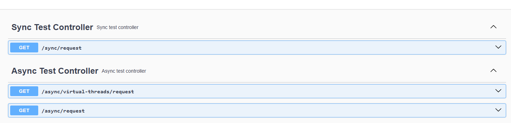
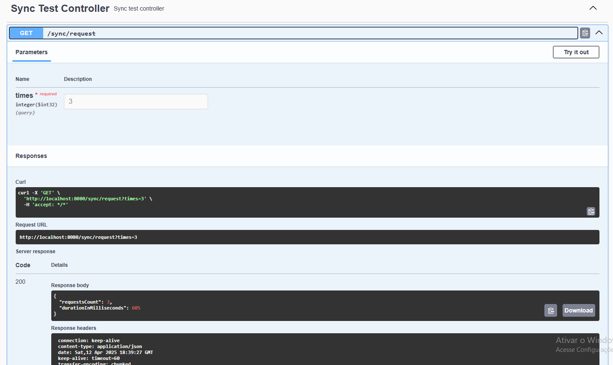

# spring-async

## Dependencies
* JDK 23
* Spring Boot
* Spring Cloud Feign

Example of service comparing Blocking Feign vs Non Blocking Multi Threads Feign vs Non Blocking Multi Virtual Threads Feign.

The service exposes three endpoints that simulates blocking and non-blocking multiple requests to other service. For example purpose, the service endpoint is [Google URL](http://google.com).

## Run apllication

Execute the command below to initiate the application locally:

```bash
/gradlew bootRun
```

Access the local address of the application [localhost:8080](http://localhost:8080) and compare the performance of the three endpoint examples.




